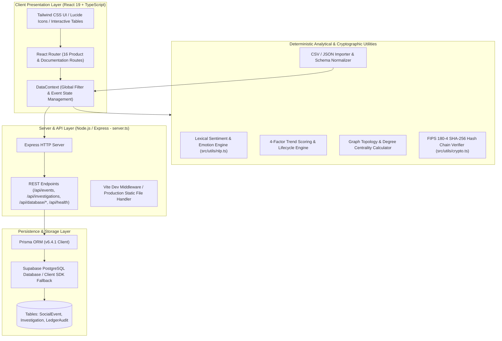
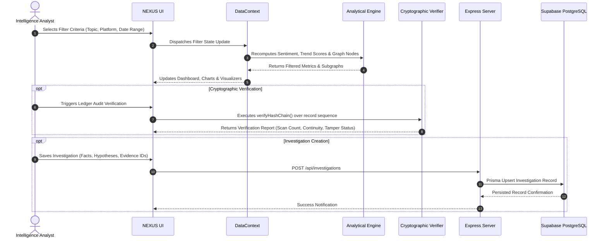
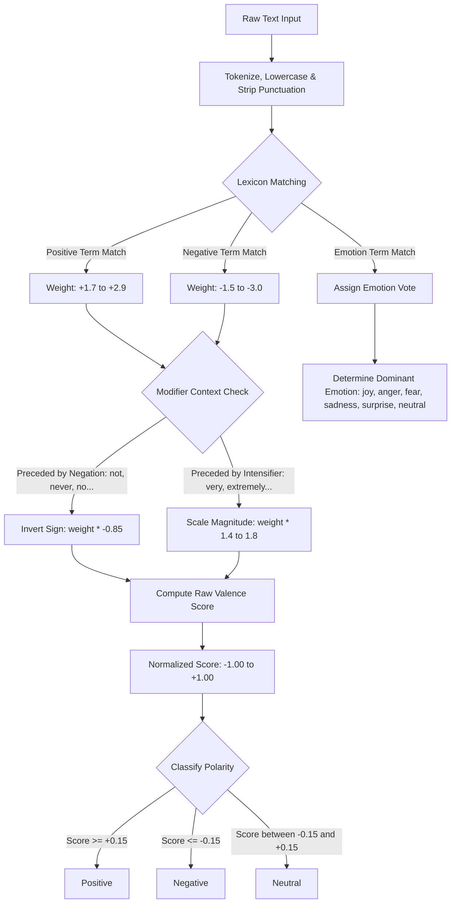
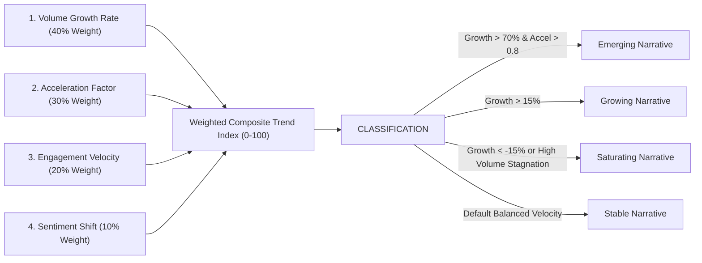
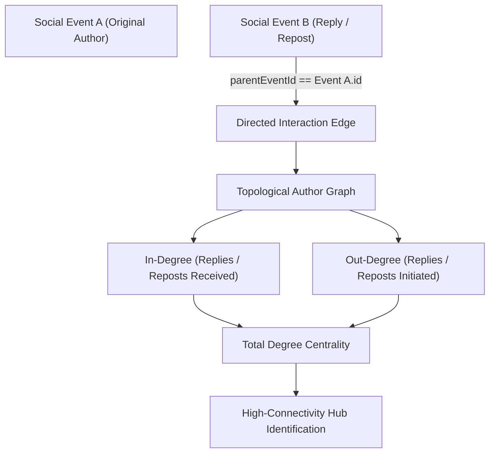
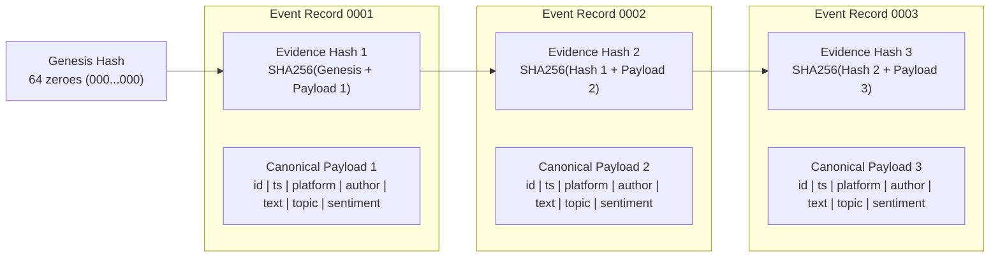
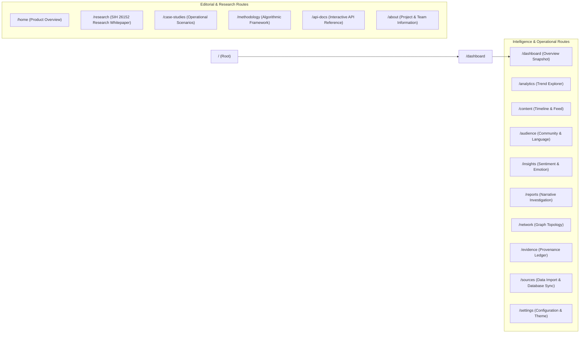
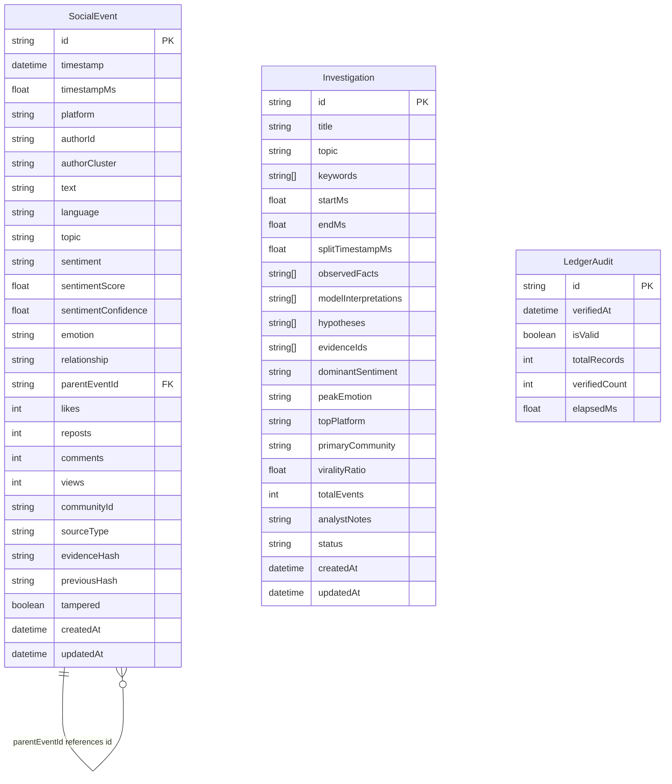
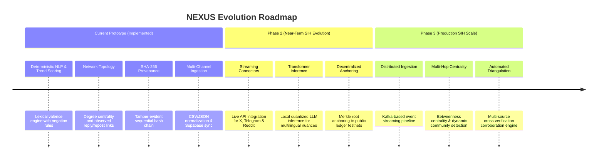

# NEXUS

<div align="center">

### Cross-Platform Social Media Analytics & Intelligence Workspace

*An explainable, multi-platform intelligence environment for narrative tracking, sentiment & emotion analysis, network topology, and tamper-evident cryptographic evidence provenance.*

<br/>

[](https://sih.gov.in)
[](https://ntro.gov.in)
[](#)
[](#)

<br/>

<!-- Tech Stack Badges with Official Logos -->
[](https://www.typescriptlang.org/)
[](https://react.dev/)
[](https://vitejs.dev/)
[](https://tailwindcss.com/)
[](https://nodejs.org/)
[](https://expressjs.com/)
[](https://www.prisma.io/)
[](https://www.postgresql.org/)
[](https://supabase.com/)
[](#)

</div>

---

## 👥 Team Details & Hackathon Credits

> **Developed for Smart India Hackathon (SIH 2026)**  
> **Problem Statement:** 26152 — *Social Media Analytics*  
> **Department:** Computer Science & Engineering (CSE) — **2nd Year**  
> **Team Name:** **Caffeine Coders**

<div align="center">

| Role | Name | Department & Year | Primary Focus Areas |
|:---|:---|:---|:---|
| 👑 **Team Leader** | **Shivam Suthar** | CSE — 2nd Year | System Architecture, Full-Stack Integration & Cryptographic Layer |
| 💻 **Team Member** | **Zarna Modhia** | CSE — 2nd Year | Frontend Experience, Sentiment & Emotion Analytics UI |
| 📊 **Team Member** | **Hetvi Vyas** | CSE — 2nd Year | Data Modeling, Narrative Investigation & Trend Metrics |
| 🔍 **Team Member** | **Apurva Prajapati** | CSE — 2nd Year | Lexical NLP Classification & Audience Intelligence |
| 🌐 **Team Member** | **Prince Agrawal** | CSE — 2nd Year | Network Graph Topology & Interaction Link Analysis |
| ⚡ **Team Member** | **Jeet Prajapati** | CSE — 2nd Year | Database Persistence, REST APIs & Data Ingestion Pipelines |

</div>

---

## 📑 Table of Contents

1. [Executive Summary](#1-executive-summary)
2. [SIH Problem Statement Alignment (ID: 26152)](#2-sih-problem-statement-alignment-id-26152)
3. [Technologies Used](#3-technologies-used)
4. [Demonstration Dataset & Data Specifications](#4-demonstration-dataset--data-specifications)
5. [System Architecture](#5-system-architecture)
6. [End-to-End Data Flow](#6-end-to-end-data-flow)
7. [Core Analytical Modules & Algorithms](#7-core-analytical-modules--algorithms)
   - [A. Explainable Lexical Sentiment & Emotion Engine](#a-explainable-lexical-sentiment--emotion-engine)
   - [B. Deterministic Trend Scoring & Lifecycle Engine](#b-deterministic-trend-scoring--lifecycle-engine)
   - [C. Audience & Community Intelligence](#c-audience--community-intelligence)
   - [D. Network Topology & Degree Centrality Graph](#d-network-topology--degree-centrality-graph)
   - [E. Narrative Investigation Management](#e-narrative-investigation-management)
   - [F. Cryptographic Hash-Chain Evidence Provenance](#f-cryptographic-hash-chain-evidence-provenance)
8. [User Experience & Product Navigation](#8-user-experience--product-navigation)
9. [Backend & Database Architecture](#9-backend--database-architecture)
10. [REST API Documentation](#10-rest-api-documentation)
11. [Data Ingestion & Normalization Engine](#11-data-ingestion--normalization-engine)
12. [Repository Structure](#12-repository-structure)
13. [Environment Configuration & Variables](#13-environment-configuration--variables)
14. [Installation & Local Setup Guide](#14-installation--local-setup-guide)
15. [Current Implementation vs. Future SIH Extension Roadmap](#15-current-implementation-vs-future-sih-extension-roadmap)
16. [Security, Integrity & Ethical Considerations](#16-security-integrity--ethical-considerations)
17. [Contributing & License](#17-contributing--license)
18. [⭐ Star Our GitHub Repository](#18--star-our-github-repository)

---

## 1. Executive Summary

NEXUS addresses the core analytical and digital forensic challenges outlined in **Smart India Hackathon (SIH) Problem Statement 26152** ("Social Media Analytics"), sponsored by the **National Technical Research Organisation (NTRO)** under the **Blockchain & Cybersecurity** theme.

Modern threat intelligence, counter-disinformation research, and public communication analysis require more than opaque sentiment scores. Analysts must:

- 📡 **Track cross-platform narratives** simultaneously across fragmented social ecosystems.
- 🎯 **Distinguish observed facts** from algorithmic interpretations and working hypotheses.
- 🕸️ **Understand narrative propagation** through directed interaction link analysis.
- 🔒 **Guarantee evidence integrity** so archived social events cannot be retroactively altered, falsified, or purged.

NEXUS delivers a unified, deterministic intelligence environment featuring explainable rule-based natural language processing, four-factor trend acceleration indices, graph-based hub and interaction analysis, investigation report generation, and **FIPS 180-4 compliant SHA-256 cryptographic hash-chaining** for verifiable evidence integrity.

---

## 2. SIH Problem Statement Alignment (ID: 26152)

<div align="center">

| SIH Requirement | NEXUS Implementation Status | Implemented Functional Scope | Architectural Boundaries & Limitations |
|:---|:---:|:---|:---|
| **A. Continuous Data Collection & Timeline Management** | **Partially Implemented (Prototype)** | Deterministic 72-hour synthetic dataset (1,200 events) across 5 platforms, temporal filtering, chronological scrubbers, CSV/JSON batch ingestion, and PostgreSQL persistence. | No active live platform scraping or automated streaming Daemons; ingestion is driven via structured import pipelines and static simulation seeds. |
| **B. Multi-Dimensional Sentiment & Emotion Inference** | **Implemented Baseline** | Explainable Lexical Valence Scoring (AFINN/VADER derivative with Negation & Modifier rules), 6 emotion classes (`joy`, `anger`, `fear`, `sadness`, `surprise`, `neutral`), confidence scoring, and interactive sandbox testing. | Uses a deterministic rule-based lexicon rather than fine-tuned neural transformer models or external LLM API endpoints. |
| **C. Automated Demographic & Community Profiling** | **Partial / Structural** | Community cluster segmentation (5 defined clusters), pseudonymous author metadata, multi-language tracking (`en`, `es`, `fr`, `de`, `hi`), and cross-platform affinity distribution. | Profiles represent structural interaction groups and pseudonymous handles; does not perform invasive or speculative inference of real-world age, gender, or home addresses. |
| **D. Real-Time Trend & Topic Detection** | **Implemented Analytically** | Deterministic four-factor trend algorithm evaluating Volume Growth (40%), Acceleration (30%), Engagement Velocity (20%), and Sentiment Shift (10%) with lifecycle state classification (`emerging`, `growing`, `saturating`, `stable`). | Scores are computed deterministically over the active temporal window rather than using predictive regression models. |
| **E. Link Analysis & Network Topology** | **Implemented Baseline** | Graph construction from observed `parentEventId` reply/repost relationships, computing in-degree, out-degree, total degree centrality, and connectivity hub identification. | Metrics reflect observed interactions in event metadata. Does not calculate PageRank or betweenness centrality. |

</div>

---

## 3. Technologies Used

NEXUS is engineered with a modern, high-performance, type-safe full-stack ecosystem:

### 🎨 Frontend & Interface
- **React 19 (`^19.0.1`)**: Component-driven declarative UI architecture with modern React Hooks and state concurrency.
- **TypeScript (`^7.0.2`)**: End-to-end type safety, strict interface contracts, and compilation guarantees.
- **Vite 8 (`^8.3.2`)**: Next-generation development server and lightning-fast ES-module bundler.
- **Tailwind CSS 4 (`^4.3.3`)**: High-performance utility-first styling with responsive, analytical UI design.
- **Lucide React (`^0.546.0`)**: Comprehensive set of vector iconography for analytics and dashboards.
- **React Router 7 (`^7.18.4`)**: Client-side SPA routing with 16 distinct analytical and documentation routes.

### ⚙️ Backend & API
- **Node.js (`>=18.0.0`)**: High-throughput JavaScript runtime engine.
- **Express.js (`^4.21.2`)**: Robust REST API framework for database diagnostics, event batching, and investigation CRUD.
- **tsx (`^4.21.0`) & esbuild (`^0.28.2`)**: Rapid TypeScript execution and build compilation.

### 🗄️ Database & Storage Layer
- **PostgreSQL**: Enterprise-grade relational database for structured event, investigation, and audit records.
- **Prisma ORM (`^6.4.1`)**: Next-generation TypeScript ORM with schema migrations and type-safe query generation.
- **Supabase PostgreSQL (`@supabase/supabase-js ^2.117.2`)**: Scalable cloud database infrastructure with direct pooler support.

### 🧠 Analytical & Cryptographic Utilities
- **Deterministic Lexical NLP Engine**: Transparent valence classification with contextual negation/intensifier modifiers.
- **4-Factor Narrative Trend Acceleration Index**: Weighted composite scoring model (0–100 scale).
- **FIPS 180-4 SHA-256 Cryptographic Engine**: Pure TypeScript cryptographic hash-chaining for tamper-evident provenance.

---

## 4. Demonstration Dataset & Data Specifications

NEXUS includes a deterministic PRNG-generated baseline dataset (`src/data/mockDataGenerator.ts`) created using a seeded Mulberry32 algorithm. This guarantees reproducible analytics across test environments.

### 📊 Synthetic Corpus Parameters

```text
├── Event Volume:           1,200 normalized social events
├── Author Profiles:        120 unique pseudonymous identities
├── Monitored Platforms:    5 (X/Twitter, Telegram, YouTube, Reddit, Bluesky)
├── Temporal Window:        72 continuous hours (simulated hourly progression)
├── Analytical Topics:      6 distinct narrative categories
├── Community Clusters:     5 behavioral clusters
├── Supported Languages:    5 languages (English, Spanish, French, German, Hindi)
└── Evidence Chain:         1,200 cryptographically chained SHA-256 hashes
```

### 🏷️ Monitored Analytical Topics

1. **Deepfake Election Rumors** — Synthetic audio and disinformation cascades leading to high-panic/negative emotion shifts.
2. **Clean Energy Grid Transition** — Infrastructure updates, grid reliability data, and policy discussions.
3. **Autonomous Vehicle Safety** — Safety records, sensor malfunction reports, and public sentiment inflections.
4. **AI Copyright Regulation** — Legislative debates, intellectual property rights, and fair-use disputes.
5. **Semiconductor Supply Chain** — Fabrication capacity, global logistics, and geopolitical trade dynamics.
6. **Urban Air Mobility** — Advanced air mobility prototyping, airspace safety protocols, and public perception.

### 👥 Defined Community Clusters

- **Cluster-Alpha: Tech & Policy Experts** — Regulatory compliance, AI policy, and technical evaluation.
- **Cluster-Beta: Citizen Watchdogs** — Fact-checking, disinformation identification, and synthetic media debunking.
- **Cluster-Gamma: Industry Operators** — Energy infrastructure, logistics, and manufacturing operations.
- **Cluster-Delta: Fringe Skeptics & Amplifiers** — Sensationalism, unverified claims, and high-velocity amplification.
- **Cluster-Epsilon: Academic & Legal Analysts** — Copyright law, judicial precedents, and ethical analysis.

---

## 5. System Architecture

NEXUS follows a decoupled client-server architecture with an Express-based API layer, client-side analytical context, Prisma ORM database abstraction, and local deterministic computational engines.



---

## 6. End-to-End Data Flow



---

## 7. Core Analytical Modules & Algorithms

### A. Explainable Lexical Sentiment & Emotion Engine

The sentiment module in `src/utils/nlp.ts` operates via a transparent, fully explainable rule-based classifier based on valence-scored lexicons. It does not use opaque deep learning weights or external cloud inference.



#### Lexicon Configuration Sample
- **Positive Terms**: `breakthrough (+2.8)`, `milestone (+2.2)`, `verified (+2.4)`, `secure (+2.2)`, `flawless (+2.9)`.
- **Negative Terms**: `fatal (-3.0)`, `catastrophic (-3.0)`, `disinformation (-2.9)`, `deepfake (-2.6)`, `breach (-2.5)`.
- **Negation Words**: `not`, `don't`, `never`, `hardly`, `barely`, `without`, `no`.
- **Intensifiers**: `very (1.4x)`, `extremely (1.8x)`, `massively (1.6x)`, `highly (1.5x)`.

---

### B. Deterministic Trend Scoring & Lifecycle Engine

Trend scores are calculated across temporal slices (Baseline 50% vs. Recent 50% vs. Latest 25% of the time window) using a documented 4-factor weighted formula:

$$\text{Trend Score} = (\text{NormGrowth} \times 0.40) + (\text{NormAccel} \times 0.30) + (\text{NormEng} \times 0.20) + (\text{NormSentShift} \times 0.10)$$



---

### C. Audience & Community Intelligence

The audience module aggregates structural interactions into community groups:
- **Community Slicing**: Evaluates volume, dominant sentiment, and primary platform by community cluster.
- **Language Distribution**: Tracks multilingual metadata (`en`, `es`, `fr`, `de`, `hi`).
- **Platform Affinity**: Measures platform market share across social channels.
- **Node Activity Ranking**: Identifies high-output pseudonymous handles.

---

### D. Network Topology & Degree Centrality Graph

NEXUS constructs interaction graphs directly from metadata pointers (`parentEventId` matching target event `id` values).



> **Methodological Note:** Network proximity and in-degree connectivity demonstrate observed interaction topology in the data corpus. They do **not** independently prove coordinated inauthentic behavior, collusion, or criminal culpability.

---

### E. Narrative Investigation Management

NEXUS provides structured investigation report workflows to enforce rigorous analytical standards:
- **Observed Facts**: Empirically verified metadata points and recorded evidence IDs.
- **Model Interpretations**: Analytical outputs derived from lexical classification and trend acceleration.
- **Working Hypotheses**: Analyst-formulated theories regarding narrative origin or propagation intent.
- **Time Window & Inflection Split**: Start/end timestamps and critical narrative shift markers.
- **Persistence**: Saved directly to PostgreSQL via Prisma ORM (`Investigation` table).

---

### F. Cryptographic Hash-Chain Evidence Provenance

To satisfy the **Blockchain & Cybersecurity** theme without introducing heavy consensus protocols, NEXUS implements **FIPS 180-4 compliant SHA-256 sequential hash chaining**.



#### Verification Criteria (`verifyHashChain`)
1. **Chain Continuity**: Every record's `previousHash` must strictly match the `evidenceHash` of the immediately preceding record.
2. **Payload Integrity**: Recomputing `SHA256(previousHash | id | timestamp | platform | authorId | text | topic | sentiment)` must equal the recorded `evidenceHash`.
3. **Tamper Localization**: If any record is modified, the audit scanner identifies the exact index and record ID where the chain was broken.

#### Architectural Comparison

<div align="center">

| Feature | NEXUS Tamper-Evident Hash Chain | Distributed Blockchain |
|:---|:---|:---|
| **Cryptographic Algorithm** | SHA-256 (FIPS 180-4) | SHA-256, Keccak-256, etc. |
| **Tamper Detection** | Instantaneous mathematical verification | Cryptographic consensus & state roots |
| **Decentralized Consensus** | No (Local & Centralized DB Storage) | Yes (Proof-of-Stake / Proof-of-Work) |
| **Smart Contracts / Gas** | None (Zero overhead) | Required for execution |
| **Audit Verification Speed** | Sub-millisecond (1,200 records in < 8ms) | Dependent on block confirmation times |

</div>

---

## 8. User Experience & Product Navigation

The application provides a comprehensive workspace organized into analytical and editorial routes:



---

## 9. Backend & Database Architecture

### Prisma Entity Relationship Diagram



---

## 10. REST API Documentation

The backend service (`server.ts`) exposes the following endpoints:

### 1. Database Health Check
- **Endpoint:** `GET /api/database/status`
- **Description:** Checks PostgreSQL / Supabase connection health, ORM state, and active record counts.
- **Response `200 OK`:**
  ```json
  {
    "status": "connected",
    "orm": "Prisma ORM (v6.4.1)",
    "provider": "Supabase PostgreSQL",
    "configured": {
      "hasDatabaseUrl": true,
      "hasDirectUrl": true,
      "hasSupabaseUrl": true,
      "hasSupabaseAnonKey": true
    },
    "counts": { "events": 1200, "investigations": 3 },
    "error": null
  }
  ```

### 2. Service Liveness
- **Endpoint:** `GET /api/health`
- **Description:** Returns service uptime, timestamp, and database binding state for container orchestration.
- **Response `200 OK`:**
  ```json
  {
    "status": "healthy",
    "timestamp": "2026-10-05T10:45:00.000Z",
    "uptime": 142.5,
    "database": true
  }
  ```

### 3. Retrieve Events
- **Endpoint:** `GET /api/events`
- **Query Parameters:**
  - `topic` *(string, optional)*: Filter by narrative topic.
  - `platform` *(string, optional)*: Filter by platform name.
  - `limit` *(integer, optional, default: 2000)*: Max records to return.
- **Response `200 OK`:** Returns `{ events: SocialEvent[], total: number }`.

### 4. Batch Ingest Events
- **Endpoint:** `POST /api/events/batch`
- **Body:** `{ "events": [ ...normalized SocialEvent objects... ] }`
- **Response `200 OK`:** `{ "success": true, "count": 1200 }`

### 5. Investigation Management
- **`GET /api/investigations`**: Retrieves all persisted investigations ordered by creation date.
- **`POST /api/investigations`**: Upserts an investigation record with facts, interpretations, and hypotheses.
- **`DELETE /api/investigations/:id`**: Deletes a specific investigation record by ID.

---

## 11. Data Ingestion & Normalization Engine

NEXUS includes client-side CSV and JSON ingestion pipelines (`src/pages/DataSources.tsx` and `src/context/DataContext.tsx`).

### CSV Import Specification

Uploaded CSV files must contain at least one text column (`text`, `content`, or `post`). Optional supported headers:

```csv
timestamp,platform,author,topic,text,sentiment
2026-10-01T12:00:00Z,X/Twitter,@analyst_delta,Deepfake Election Rumors,"Forensic watermarking confirms synthetic audio.",positive
```

When imported:
1. Text is classified via `classifyText()` to determine sentiment, score, confidence, and dominant emotion.
2. An incremental SHA-256 evidence hash is computed and linked to the preceding record.
3. The dataset is marked with `sourceType: "IMPORTED"`.

---

## 12. Repository Structure

```text
Nexus-socialMediaAnalytics-main/
├── prisma/
│   └── schema.prisma              # Prisma schema definition (PostgreSQL)
├── src/
│   ├── components/
│   │   ├── layout/                # AppLayout, Sidebar, Header, Subnav, Footers
│   │   ├── modals/                # DatabaseConfigModal, PostDetailModal
│   │   └── website/               # Landing page & navigation components
│   ├── context/
│   │   └── DataContext.tsx        # Central state, filters, database sync & ingestion
│   ├── data/
│   │   ├── mockDataGenerator.ts   # Mulberry32 1,200-event synthetic dataset generator
│   │   └── sampleInvestigations.ts# Pre-populated investigative intelligence records
│   ├── lib/
│   │   ├── prisma.ts              # Prisma client initialization & DDL migration runner
│   │   └── supabase.ts            # Isomorphic Supabase client initialization
│   ├── pages/
│   │   ├── Overview.tsx           # Dashboard intelligence overview
│   │   ├── Timeline.tsx           # Chronological event explorer & filtering
│   │   ├── SentimentEmotion.tsx   # Sentiment breakdown & lexical sandbox
│   │   ├── TrendExplorer.tsx      # 4-factor trend acceleration metrics
│   │   ├── AudienceIntelligence.tsx# Community clusters & platform affinity
│   │   ├── NetworkGraph.tsx       # Graph topology visualizer & node centrality
│   │   ├── NarrativeInvestigation.tsx # Fact/hypothesis investigation workspace
│   │   ├── EvidenceProvenance.tsx # SHA-256 hash chain audit & tamper simulator
│   │   ├── DataSources.tsx        # CSV/JSON import & Supabase sync
│   │   ├── Settings.tsx           # Environment & platform settings
│   │   └── website/               # Research doc, Case studies, Methodology, API docs
│   ├── types/
│   │   └── index.ts               # Core TypeScript interface definitions
│   ├── utils/
│   │   ├── crypto.ts              # FIPS 180-4 SHA-256 hash chaining & verification
│   │   └── nlp.ts                 # Lexical sentiment, emotion & trend scoring algorithms
│   ├── App.tsx                    # Routing configuration
│   ├── index.css                  # Tailwind CSS import & global rules
│   └── main.tsx                   # React root entry point
├── server.ts                      # Express server with Vite middleware & REST endpoints
├── package.json                   # Dependencies, scripts & engine specifications
├── tsconfig.json                  # TypeScript compiler settings
├── vite.config.ts                 # Vite build & Tailwind plugin configuration
└── .env.example                   # Environment variable template
```

---

## 13. Environment Configuration & Variables

<div align="center">

| Variable | Scope | Description | Required For |
|:---|:---:|:---|:---|
| `DATABASE_URL` | Server | Supabase PostgreSQL connection URI (with transaction pooler). | Prisma database persistence. |
| `DIRECT_URL` | Server | Direct PostgreSQL connection string for Prisma migrations. | Direct schema operations. |
| `SUPABASE_URL` | Client & Server | Supabase project API URL. | Supabase JS client integration. |
| `SUPABASE_ANON_KEY` | Client & Server | Public Supabase anonymous API key. | Supabase JS client queries. |
| `APP_URL` | Server | Deployed base application URL. | Hosting & metadata references. |
| `GEMINI_API_KEY` | Server | Configuration placeholder for future LLM integration. | *Optional / Unused in current deterministic release.* |

</div>

> **Note on Fallback Mode:** If `DATABASE_URL` is omitted, NEXUS automatically falls back to in-memory state initialized with the deterministic 1,200-event dataset. All analytical and cryptographic tools remain fully functional without external database credentials.

---

## 14. Installation & Local Setup Guide

### 📋 Prerequisites
- **Node.js**: `v18.0.0` or higher (`v20+` recommended)
- **npm**: `v9.0.0` or higher

```bash
# 1. Clone the repository
git clone https://github.com/your-org/nexus-social-media-analytics.git
cd nexus-social-media-analytics

# 2. Install exact dependencies
npm install

# 3. Copy example environment configuration
cp .env.example .env

# 4. Generate Prisma ORM Client
npm run prisma:generate

# 5. Launch Development Server
npm run dev
```

The application will be accessible at `http://localhost:3000`.

### 🏗️ Build & Validation Commands
```bash
# Validate TypeScript compliance
npm run lint

# Compile production bundle
npm run build

# Start production server
npm run start
```

---

## 15. Current Implementation vs. Future SIH Extension Roadmap



---

## 16. Security, Integrity & Ethical Considerations

1. **Deterministic & Explainable Analytics**: The analytical scoring rules avoid ungrounded hallucinations by relying on transparent lexical weights and deterministic arithmetic.
2. **Cryptographic Tamper Detection**: The SHA-256 hash chain prevents silent post-hoc tampering of archived intelligence records.
3. **Data Privacy & Handling**: The demonstration dataset uses exclusively pseudonymous synthetic identifiers (`@tech_policy_lead`, `@factcheck_bot`, etc.) to prevent privacy infringement.
4. **Distinction of Analytical Claims**: The platform strictly isolates **Observed Facts** from **Model Interpretations** and **Working Hypotheses** in all investigation reporting.

---

## 17. Contributing & License

### Contributing Workflow
1. Fork the repository.
2. Create a dedicated feature branch (`git checkout -b feature/advanced-graph-metrics`).
3. Commit verified, type-checked modifications (`npm run lint` && `npm run build`).
4. Submit a Pull Request with complete technical documentation.

### License
This repository is released under standard open-source evaluation terms for Smart India Hackathon (SIH) 2026 evaluation under Problem Statement ID 26152 (NTRO).

---

## 18. ⭐ Star Our GitHub Repository

<div align="center">

### 🌟 Found NEXUS insightful? Show your support!

If you find this project valuable for social intelligence research, disinformation analytics, or tamper-evident forensic architectures, please consider giving our repository a **Star** on GitHub!

<br/>

[](https://github.com/)

<br/>

*Built with passion by **Team Caffeine Coders** (CSE 2nd Year) for SIH 2026*

</div>
